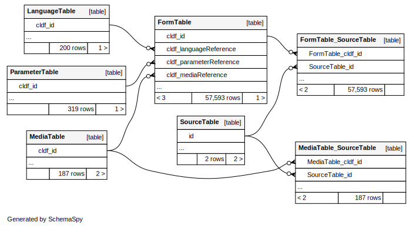

# CLDF dataset derived from Koelle's "Polyglotta Africana" from 1854

[](https://github.com/lexibank/polyglottaafricana/actions?query=workflow%3ACLDF-validation)

## How to cite

If you use these data please cite
- the original source
  > Koelle, Sigismund W. (1854). Polyglotta Africana or Comparative Vocabulary of Nearly Three Hundred Words and Phrases in more than One Hundred Distinct African Languages. London: Church Missionary House.
- the derived dataset using the DOI of the [particular released version](../../releases/) you were using

## Description


This dataset is licensed under a CC-BY-4.0 license


Conceptlists in Concepticon:
- [Koelle-1854-280](https://concepticon.clld.org/contributions/Koelle-1854-280)
## Notes

## Digitization

The digital data was obtained from the RefLex database (Reference Lexicon of Africa) edited by 
G. Ségérer (https://reflex.cnrs.fr/).


## Coverage

Polyglotta Africana covers almost 200 language varieties from 8 language families.


## Data model

See [cldf/README.md](cldf) for a description of the tables and columns and the
[entity-relationship diagram](erd.svg) for how they relate.



Thus, displaying [words as listed in the book](https://resolver.sub.uni-hamburg.de/kitodo/PPN862704383/page/42) - i.e. 
with a concept as column and varieties as rows - can be done - for example using the tools of the 
[csvkit](https://csvkit.readthedocs.io/en/latest/) package - as follows:

```shell
$ csvjoin -c Language_ID,ID cldf/forms.csv cldf/languages.csv | csvgrep -c Parameter_ID -m 1_one | csvcut -c Language_ID,Name,Form,Segments | csvformat -T
Language_ID	Name	Form	Segments
I-A-1	Fúlup	fánọd	f á/a n o˞ d
I-A-2	Fī́lham	ánod	á/a n o d
I-B-1	Bṓla	pulólo	p u l ó/o l o
I-B-2	Sárār	pulálan·	p u l á/a l a n
I-B-3	Pẹ́pẹ̄l	olón·	o l ó/o n
I-B-3	Pẹ́pẹ̄l	olón·olón·	o l ó/o n o l ó/o n
I-B-3	Pẹ́pẹ̄l	púlon·	p ú/u l o n
I-B-4	Kányōp	púlọ̄́lẹ	p ú/u l o˞ː l e˞
...
```


## Statistics


[](https://github.com/lexibank/polyglottaafricana/actions?query=workflow%3ACLDF-validation)


- **Varieties:** 200
- **Concepts:** 319
- **Lexemes:** 57,593
- **Sources:** 1
- **Synonymy:** 1.11
- **Invalid lexemes:** 0
- **Tokens:** 347,295
- **Segments:** 93 (0 BIPA errors, 0 CLTS sound class errors, 93 CLTS modified)
- **Inventory size (avg):** 45.45

# Contributors

Name | GitHub user | Description | Role
--- |------------| --- | ---
Sigismund Koelle |            | author | Author
Guillaume Segerer |            | maintainer | Editor, DataCurator
Robert Forkel | @xrotwang  | patron, code | Editor
Johann-Mattis List | @lingulist | patron, code | Editor
Tiago Tresoldi | @tresoldi  | profile, code | Other


## CLDF Datasets

The following CLDF datasets are available in [cldf](cldf):

- CLDF [Wordlist](https://github.com/cldf/cldf/tree/master/modules/Wordlist) at [cldf/cldf-metadata.json](cldf/cldf-metadata.json)